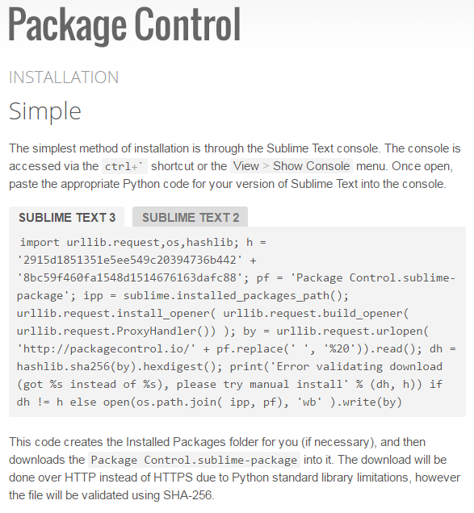

# Package Control
> Author : [Floyda](http://floyda.xyz/)
> Date   : 2016-5-10

[TOC]

## 介绍

顾名思义, `Package Control`就是用来管理Sublime的package的控制器.
通过`command panel(Ctrl + Shift + P)`, 输入'Package Control'或者'pc'打开(Sublime提供了模糊搜索功能)
有以下功能:

```python
# version: 3103
"Package Control: Add Repository",
"Package Control: Add Channel",
"Package Control: Advanced Install Package",
"Package Control: Create Package File",
"Package Control: Disable Package",
"Package Control: Discover Packages",
"Package Control: Enable Package",
"Package Control: Grab CA Certs",
"Package Control: Install Local Dependency",
"Package Control: Install Package",
"Package Control: List Packages",
"Package Control: Remove Channel",
"Package Control: List Unmanaged Packages",
"Package Control: Remove Package",
"Package Control: Remove Repository",
"Package Control: Upgrade Package",
"Package Control: Upgrade/Overwrite All Packages",
"Package Control: Satisfy Dependencies",
"Preferences: Package Control Settings – Default",
"Preferences: Package Control Settings – User",
"Package Control: Tests",
```

## 安装

打开官网[https://packagecontrol.io/installation](https://packagecontrol.io/installation)

```python
"""
WARNING: Please do not redistribute the install code via another website.
It will change with every release. Instead, please link to this page.
"""
这段安装代码, 每一个release版本都会改变. 请不要通过其他网站的安装代码重新分布.
请多惠顾!
```



1.根据Sublime的版本来选择安装代码.
2.复制文本框中的内容.
3.在Sublime打开Console(Ctrl + `), 粘贴安装代码到输入框, 回车.
4.等待若干时间, 成功与否, 都会有提示

## 使用

- pci
打开`command panel`, 输入'pci', 回车, 然后根据关键字搜索Package, 回车安装.
- pcr
打开`command panel`, 输入'pcr', 回车, 然后选择已经安装的Packages, 回车卸载.
- pcl
打开`command panel`, 输入'pci', 回车, 查看已经安装的Packages列表, 回车打开该Package的位置.
- ...
