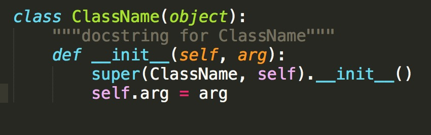

# 修改变量颜色
> Author : [Floyda](http://floyda.xyz/)  
> Date   : 2016-06-28  
> Github : https://github.com/Sublime-Chinese/sublime-zh  

[TOC]

### 0. 思路  
Sublime通过`.sublime-syntax`文件来定义某种语言的语法以及配色,  
而配色的规则是在`.tmTheme`文件中定义.  

所以, 我们想改变某一类型单词的颜色, 修改这2个文件就可以了.


### 1. 首先要知道`.tmTheme`文件在哪?
- Windows:  
`D:\Sublime Text\Package\Color Scheme - Default.sublime-package`

- Mac:  
`/Applications/Sublime Text.app/Contents/MacOS/Packages/Color Scheme - Default.sublime-package`

- 其实就是在Sublime的安装目录下的Packages目录下, 如果是使用了其他的配色文件, 你应该知道在哪里!

`.tmTheme`在`Color Scheme - Default.sublime-package`里面.  


### 2. `.sublime-syntax`在哪?  
> - 如果是Sublime支持的语法, `.sublime-syntax`也在上面的Packages里面.  
> - 如果不支持, 又非要Sublime来写, 比如汇编, 请自己想办法弄一个出来.  

假设我们修改Python中self的颜色, 找到`Python.sublime-package`.  
`Python.sublime-syntax`在它里面.  


### 3. 怎么打开`.sublime-package`?  
其实就是zip包  
Windows修改后缀名为`.zip`, 然后解压.  
Mac用`unzip`解压, 或者用其他工具.  

找到上述的2个文件, copy出来.  


### 4. 重载这2个文件.  
将这2个文件丢到[Package Path](https://github.com/Sublime-Chinese/sublime-zh/blob/master/lesson/packages_path.md)的User目录下.  

在`Preferences.sublime-settings`(Package Control -> Preferences: Settings - User)文件中重新定义一下.  
```
"color_scheme": "Packages/User/Monokai.tmTheme",
```


### 5. 修改`.tmTheme`  
打开`Monokai.tmTheme`  
在`array`下有若干个dict  
copy一个形如:  
```
<dict>
    <key>name</key>
    <string>Comment</string>
    <key>scope</key>
    <string>comment</string>
    <key>settings</key>
    <dict>
        <key>foreground</key>
        <string>#75715E</string>
    </dict>
</dict>
```  
修改为:  
```  
<dict>
    <key>name</key>
    <string>Test</string>
    <key>scope</key>
    <string>test</string>
    <key>settings</key>
    <dict>
        <key>foreground</key>
        <string>#75715E</string>
    </dict>
</dict>
```  


### 6. 修改`.sublime-syntax`  
打开`Python.sublime-syntax`  
找到:
```
language_variables:
    - match: \b(self|cls)\b
      scope: variable.language.python
```  
修改为:  
```
language_variables:
    - match: \b(self|cls)\b
      scope: test.language.python
```


### 7. 打开一个Python看看效果  

